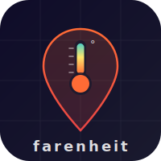

<p align="center">
  
</p>

# farenheit

**Geographic price transparency for digital products.**

Companies charge different prices for the same product depending on where you appear to be browsing from. farenheit surfaces those differences — live where possible, reference data where not — and tells you exactly how much you're leaving on the table.

```
/farenheit spotify

  farenheit ── Spotify Premium (Individual)
  ─────────────────────────────────────────
  🇦🇷 Argentina   ARS$369      $0.41    -97%  ✓
  🇹🇷 Turkey      ₺39.99       $1.27    -91%
  🇮🇳 India       ₹119         $1.43    -90%
  🇧🇷 Brazil      R$10.90      $2.01    -86%
  🇺🇸 US          $13.99       $13.99   — (baseline)
  🇬🇧 UK          £11.99       $15.05   +57% ↑
  ─────────────────────────────────────────
  💡 Cheapest: Argentina — save $13.58/mo ($163/yr)
```

---

## Install

farenheit is a [Claude Code](https://claude.ai/code) skill. It runs inside your Claude Code session — no npm, no Python, no dependencies.

```bash
# Copy the skill to your Claude skills directory
cp -r farenheit/ ~/.claude/skills/farenheit/
```

That's it. Open a Claude Code session and type `/farenheit`.

---

## How to install

farenheit is a [Claude Code](https://claude.ai/code) skill — a plain Markdown instruction file that Claude reads and executes. No npm, no Python, no API keys.

```bash
# Clone or download, then copy to your skills directory
cp -r farenheit/ ~/.claude/skills/farenheit/
```

Open a Claude Code session. Type `/farenheit`. That's it.

**What Claude Code does under the hood:** Claude reads `SKILL.md`, fetches live prices using the Firecrawl MCP (for URL-based products), fetches live exchange rates from Frankfurter (free, no auth), and formats a sorted comparison table in your terminal. For zip-mode queries, it uses the `unified-browser` MCP (Playwright).

**MCPs required:**
- `firecrawl` — web scraping (for `live: true` products and `--proxy` flag)
- `unified-browser` — Playwright browser automation (for `--zip` mode)
- Neither requires paid accounts beyond whatever plan you're already on

---

## Usage

```bash
/farenheit [any product name]                     # open-world — works with or without catalog entry (v4)
/farenheit --category [category]                  # scan a full category
/farenheit --all                                  # scan everything in the catalog
/farenheit [product] --markets IN,TR,AR           # specific markets only
/farenheit --proxy [product]                      # force live scrape via geo-routing (v2b)
/farenheit goodrx [drug]                          # intra-US zip comparison (v2a — auto-selects zips)
/farenheit --category domestic                    # scan all domestic products (auto zips)
/farenheit --portfolio [p1],[p2],[p3]             # aggregate savings across your stack (v3)
/farenheit --add [pricing url]                    # auto-generate a catalog entry from any page (v3)
```

**Categories:** `streaming` · `saas` · `software` · `cloud` · `gaming` · `hardware` · `domestic`

**Examples:**
```bash
/farenheit spotify                         # known product — uses catalog cache
/farenheit cursor                          # unknown product — live discovery (v4)
/farenheit perplexity pro                  # unknown product — live discovery (v4)
/farenheit adobe creative cloud
/farenheit --category gaming
/farenheit --proxy grammarly
/farenheit goodrx lisinopril
/farenheit --portfolio spotify,adobe creative cloud,notion,grammarly
/farenheit --add https://linear.app/pricing
```

---

## Price routing — which approach applies to what

Not all geo-pricing works the same way. farenheit routes each query based on where pricing variance is most likely to exist: **internationally** (country-level, IP/card detection), **domestically** (US zip code level, address input), or **both**.

| Service type | International | Intra-US (zip) | Where the variance lives |
|---|---|---|---|
| **Streaming** (Spotify, Netflix, Disney+) | ★★★★★ | — | Country IP at signup. India/Turkey/AR dramatically cheaper. |
| **Gaming** (Steam, Xbox, PlayStation) | ★★★★★ | — | Country store. Turkey/Argentina 70-90% cheaper on many titles. |
| **SaaS — B2C** (Notion, Grammarly, Canva) | ★★★★ | — | Country IP. India/LatAm often 50-70% cheaper. |
| **Software licenses** (Adobe, JetBrains, MS365) | ★★★★ | — | Country URL/card. India/Turkey 30-50% cheaper. |
| **Hardware** (Apple, Samsung) | ★★★ | ★ | International: import duties drive variance. Intra-US: sales tax only (~0-10%). |
| **Gig economy** (Uber, DoorDash, Instacart) | ★★ | ★★★★ | Intra-US is primary — surge pricing, market rates, delivery fees vary by city/neighborhood. |
| **E-commerce** (Amazon, retailers) | ★★ | ★★★★ | Intra-US: same product, different price by delivery zip (seller shipping zones, local competition). International: some products geo-priced but inconsistent. |
| **Insurance** (auto, home, renters) | — | ★★★★★ | Zip-code-only pricing. Same driver/property profile can be 3x different by state or city. |
| **Home services** (contractors, moving, pest control) | — | ★★★★★ | Purely local market pricing. Quote same job from NYC vs. Des Moines. |
| **Healthcare / dental** | — | ★★★★★ | Extreme intra-US variance. Same procedure, same insurance, different zip = wildly different negotiated rates. |
| **Groceries / delivery** | — | ★★★★ | Instacart, DoorDash markup and fees vary significantly by market. |
| **Cloud / infra** (AWS, Vercel, DO) | ★ | — | Mostly USD-global. Data center region affects latency/compliance, not price. |

**How to read this:** Five stars = strong signal, worth querying. Dash = negligible variance, not worth the effort.

### Routing in practice

- **International query** → `/farenheit [product]` — compares across 12 countries
- **Intra-US query** → `/farenheit [product] --zip 10001,60601,90210,78701,98101`
- **Both** → run international first, then domestic if the service type warrants it (hardware, gig economy)
- **IP-based product, live data** → add `--proxy` flag to any product that normally shows reference data

---

## How it works

**For products with URL-accessible regional pricing** (`live: true` in the catalog):
farenheit calls the Firecrawl MCP to fetch each regional pricing page and extracts the current price. No proxy needed — these companies expose regional pricing via country-specific URLs (e.g. `adobe.com/in/`, `spotify.com/tr/`).

**For products with IP-based pricing** (`live: false`):
farenheit shows curated reference prices with a freshness date. By default these are static snapshots — services like Notion or Grammarly detect your location via IP, so a plain URL request always returns your home-country price.

**With `--proxy` flag (v2b):** Firecrawl has a built-in `location` parameter that routes the scrape through a geo-specific IP. No Smartproxy or Bright Data subscription required — it uses Firecrawl's own residential proxy pool. Adding `--proxy` flips any `live: false` product to a live scrape.

**For intra-US zip pricing** (`--zip` flag, v2a):
Some products don't vary by country at all — they vary by US zip code. GoodRx drug prices, Amazon delivery prices, Instacart fees, and insurance quotes all work this way. farenheit uses the `unified-browser` MCP (Playwright) to automate zip entry and read back the displayed price for each zip you specify.

**Currency normalization:**
All prices are converted to USD using live exchange rates from [Frankfurter](https://www.frankfurter.app/) (free, no auth). Argentine Peso (ARS) is excluded from Frankfurter due to exchange controls — shown as local price with a note.

**12 international markets tracked:** United States · India · Brazil · Mexico · Turkey · Argentina · Poland · Thailand · Philippines · Nigeria · United Kingdom · Germany

---

## Coverage

| Category   | Products | Mode | Notes |
|------------|----------|------|-------|
| Streaming  | 6        | International | Spotify, Netflix, Disney+, Apple TV+ live |
| SaaS       | 12       | International | Canva, 1Password, Webflow, Zoom + `--proxy` for rest |
| Software   | 4        | International | Adobe CC, Microsoft 365, JetBrains live |
| Cloud      | 4        | Control | USD-global — included as control examples |
| Gaming     | 5        | International | Xbox, PlayStation, Nintendo, Steam live |
| Hardware   | 2        | International + domestic | Apple MacBook, iPhone — import duty variance |
| Domestic   | 6        | Intra-US zip | GoodRx, Amazon, Instacart, DoorDash, The Zebra, Thumbtack |

**Controls included:** GitHub Pro, Vercel Pro, DigitalOcean — products that charge the same price globally. Useful baseline for what *no* geo-pricing looks like.

---

## Saving money — how to actually pay the cheaper price

Finding a price gap is the easy part. Paying at the cheaper rate requires two things simultaneously: **appearing to be in that country** (VPN at signup) and **a payment method the service accepts from there**. Most services check both.

### Three approaches, ranked by ease

**1. Gift cards — cleanest, lowest friction**

Buy a gift card denominated in the target country's currency from a reseller, redeem it via VPN. No foreign payment method needed.

Works best for: Spotify, Xbox Game Pass, PlayStation Plus, Nintendo, Steam
Where to buy: [Seagm.com](https://seagm.com), [G2G.com](https://g2g.com), [Eneba.com](https://eneba.com), [Kinguin](https://kinguin.net)

Example: An Indian Spotify gift card costs ~$6 and covers 3 months. That's $2/mo vs $12.99.

**2. Wise or Revolut — best for SaaS and software**

[Wise](https://wise.com) and [Revolut](https://revolut.com) both offer multi-currency accounts with local billing addresses per country. An INR balance with an Indian billing address passes Stripe's country check — which is what most SaaS tools use.

Works best for: Adobe CC, Microsoft 365, JetBrains, most SaaS tools

**Why it works:** Stripe checks the card's BIN (first 6-8 digits — identifies issuing bank country) and billing address, not your IP. A standard US Amex has a US BIN and US billing address regardless of VPN. A Wise/Revolut INR card has a non-US BIN and Indian billing address → Stripe reads it as an Indian payment → accepts Indian pricing. Foreign transaction fees on your existing card are irrelevant — it's the card's registered country that matters.

**Wise vs. Revolut:** Revolut has deeper local banking partnerships in more countries (especially IN, TR, AR), meaning its card BIN reads more like a local issuer. Wise is more universally accepted and easier to set up. Try Revolut first for high-variance markets; Wise works well for most SaaS.

**3. VPN at signup — hit or miss**

Some smaller SaaS products only check your IP at the pricing page and don't re-verify at payment. Sign up through a VPN, pay with your normal card.

Works best for: Smaller SaaS tools that geo-price at the marketing layer but use a global payment processor.

### Quick reference by service

| Service | Best approach | Risk |
|---------|--------------|------|
| **Spotify** | Gift cards (Seagm) | Medium — AR/TR accounts get reset periodically |
| **Xbox Game Pass** | Gift cards | Low |
| **PlayStation Plus** | PSN gift cards from target country | Low |
| **Steam** | Change store country + local gift card | Low (once/year limit) |
| **Adobe CC** | Wise card with IN/TR billing | Medium |
| **Microsoft 365** | Wise card with IN billing | Low |
| **JetBrains** | Currency param at checkout + any card | Very low |
| **Netflix** | Gift cards or local payment method required | High — aggressive detection |

### The honest risk

This is a **ToS gray area, not illegal.** Prices are publicly listed — you're not hacking anything. But most ToS require you to use the service from the country you signed up in. Consequences range from account reset to home-country pricing (common) to account suspension (rare, mostly affects bulk resellers). Each person decides their own tolerance.

---

## Notable findings

A few highlights from the catalog that surprised us when building this:

- **Spotify Argentina:** ~97% cheaper than US ($0.41 vs $13.99/mo)
- **Xbox Game Pass Ultimate Turkey:** ~88% cheaper ($2.30 vs $19.99/mo)
- **Adobe Creative Cloud India:** ~40% cheaper than US
- **JetBrains All Products:** dramatic regional discounts — one of the most developer-friendly pricing structures
- **Brazil iPhone:** ~60% more expensive than US (import tax)
- **GitHub Pro:** Same $4/mo everywhere — pricing transparency done right

---

## Open-world mode (v4)

The catalog is a **speed cache, not a gate**. Ask for any product and farenheit will:

1. Check `catalog.json` for known URL patterns and reference data. If found → use it (fast path).
2. If not in the catalog → search the web via Firecrawl, find the pricing page, and probe it.
3. Classify the product: URL-based regional pricing → scrape per country. IP-based → auto-retry with geo-proxy. Same price everywhere → mark it a control and move on.

No `--add` step required before a query works. Unknown products just work — they're a little slower on the first call, and the session can optionally propose a catalog entry to cache the result for next time.

---

## The catalog is the IP

`catalog.json` is a community-maintained list of products, regional URLs, and reference prices. PRs are the highest-value contribution — if you find a product with regional pricing not in the catalog, add it.

**To add a product:**

1. Determine if it has URL-accessible regional pages (`live: true`) or IP-based detection (`live: false`)
2. Find the regional URL pattern or gather reference prices from each market
3. Add an entry to `catalog.json` in the appropriate category
4. Test with `/farenheit [your product]`
5. Submit a PR

See `catalog.json` for entry format and examples.

---

## v2a — Intra-US zip mode

The underreported story: the same product can cost meaningfully different amounts depending on your US zip code. GoodRx drug prices, Amazon delivery pricing, Instacart fees, DoorDash charges, auto insurance quotes — all vary by zip without any international component.

```bash
/farenheit goodrx lisinopril --zip 10001,60601,90210,78701,98101
/farenheit amazon B09B8RVKGM --zip 10001,60601,90210
/farenheit instacart --zip 10001,33101,98101
/farenheit --category domestic --zip 10001,60601,90210,78701,98101
```

**Why it works differently than international:** International geo-pricing is URL-addressable — change the URL path, get a different price. US zip-based pricing almost always requires **form interaction**: entering a delivery zip, submitting a quote form, clicking through to a price. farenheit uses the `unified-browser` MCP (Playwright) for this.

**Exception: GoodRx** embeds zip as a URL parameter (`?zip=10001`), so it works via Firecrawl — no browser automation needed. It's also the most compelling zip-mode target: same drug, same dosage, radically different cash price by zip and pharmacy chain. Entirely public data, zero ToS risk.

| Service | Method | Expected variance |
|---|---|---|
| **GoodRx** | URL param (`?zip=`) | Same drug, 10x price range by zip + pharmacy |
| **Amazon** | Browser — set delivery zip | $0–50 on same SKU by seller shipping zone |
| **Instacart** | Browser — zip at store select | Service fees + markup vary 2-3x by market |
| **DoorDash** | Browser — location entry | Delivery + service fees vary by market density |
| **The Zebra** | Browser — zip + driver profile | Auto insurance 2-4x by state |
| **Thumbtack** | Browser — zip + job type | Home services 3-5x by market (NYC vs. Des Moines) |

---

## v2b — Geo-proxy for IP-based products

Many products in the `saas` and `streaming` categories are marked `live: false` because they detect your location by IP — a plain URL request always returns your home-country price. The `--proxy` flag fixes this without any paid proxy subscription.

```bash
/farenheit --proxy notion
/farenheit --proxy grammarly
/farenheit --proxy hulu
```

**How it works:** Firecrawl has a built-in `location` parameter (`{country: "IN", languages: ["en-IN"]}`) combined with `proxy: "stealth"` that routes the scrape through a geo-specific residential IP. This is part of the Firecrawl MCP — no Smartproxy, Bright Data, or external proxy account required.

Adding `--proxy` flips any `live: false` product to a live scrape. Products that benefit most: Notion, Grammarly, Canva (paid tiers), Zoom, Hulu, Peacock, Paramount+.

---

## Roadmap

- **v1:** International geo-pricing — 32 products, 12 markets, live scraping + reference data ✓
- **v2a:** `--zip` mode — intra-US pricing via Playwright + Firecrawl (6 domestic products) ✓
- **v2b:** `--proxy` flag — Firecrawl geo-routing for IP-based products ✓
- **v3:** `--portfolio`, `--add`, risk-scored "How to pay" output ✓
- **v4:** Open-world mode — any product works, catalog is a cache not a gate (Firecrawl search + URL probe + auto geo-proxy) ✓
- **v5:** `--watch` mode — price change alerts (requires Supabase persistence)
- **v6:** `--travel` mode — Amadeus API for flight/hotel geo-pricing

---

## License

MIT — do whatever you want with it.

Built by [Jeff Littell](https://github.com/jefflitt1) / [JGL Ventures](https://jglventures.com).
